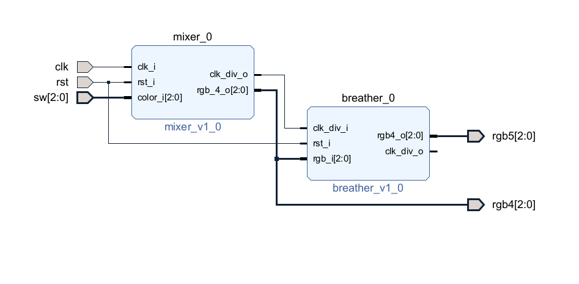
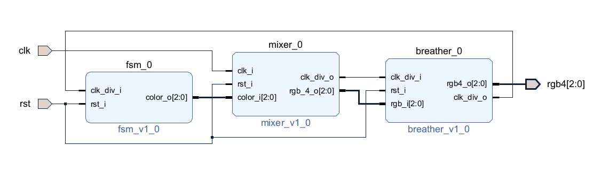

# FPGA-BreathingLight

# FPGA-BreathingLight

> 2022 Spring NCKU FPGA Course
>
> Homework 2
>
> E24076239 E24076297 E24076750

## Problem 1: Breathing Light

### Introduction

This project uses **PYNQ-Z2** to implement an RGB breathing light circuit.

### Specification

| Switch | RGB LED 4 | RGB LED 5               | Hex Triplet(RGB) |
| ------ | --------- | ----------------------- | ---------------- |
| 00     | Purple    | Purple Breathing Light  | #7F1FFF          |
| 01     | Cyan      | Cyan Breathing Light    | #00FFFF          |
| 10     | Yellow    | Yellow Breathing Light  | #FFFF00          |
| 11     | Crimson   | Crimson Breathing Light | #FF00FF          |

A **reset** signal is required between mode switches.

### Modules

1. **mixer**

   The mixer generates a divided clock and the **pwm** signal of output color.
   
   Taking an output color with a hexadecimal color code (7F1FFF) as an example, every 256 input clock cycles, the red, green, and blue pins of the LED are pulled high for 127, 31, and 255 cycles, respectively. The same method is used for other output colors.
   
   The frequency of the divided clock signal is 256 times less than the input clock, which is also the life cycle of the rgb pwm signal.

2. **breather**

   Separating the life cycle of breathing light into 32 phases, each phase has a brightness level(`brightness`).

   The input clock of breather(`clk_div_i`) is the output divided clock of mixer. A counter(`brightness_cnt`) is accumulated at each positive edge of `clk_div_i`, while `brightness_cnt` is larger than or equal to `brightness`, the LED(`rgb4_o`) will be turned on. 

### Schematic

## Problem 2: Rainbow Breathing Light

### Introduction

This project uses **PYNQ-Z2** to implement an RGB rainbow breathing light circuit.

### Specification

#### Order

Dark&rarr;**Red**&rarr;Dark&rarr;**Orange**&rarr;Dark&rarr;**Yellow**&rarr;Dark&rarr;**Green**&rarr;Dark&rarr;**Blue**&rarr;Dark&rarr;**Purple**&rarr;Dark&rarr;**Red**...

#### Color

| Color           | Red     | Orange  | Yellow  | Green   | Blue    | Purple  |
| --------------- | ------- | ------- | ------- | ------- | ------- | ------- |
| **Hex triplet** | #FF0000 | #FF6100 | #FFFF00 | #00FF00 | #0000FF | #7F1FFF |

### Modules

1. fsm

   Controlling the output color of rainbow breathing light.

2. mixer

   Same as problem 1.

3. breather

   Same as problem 1.

### Schematic

